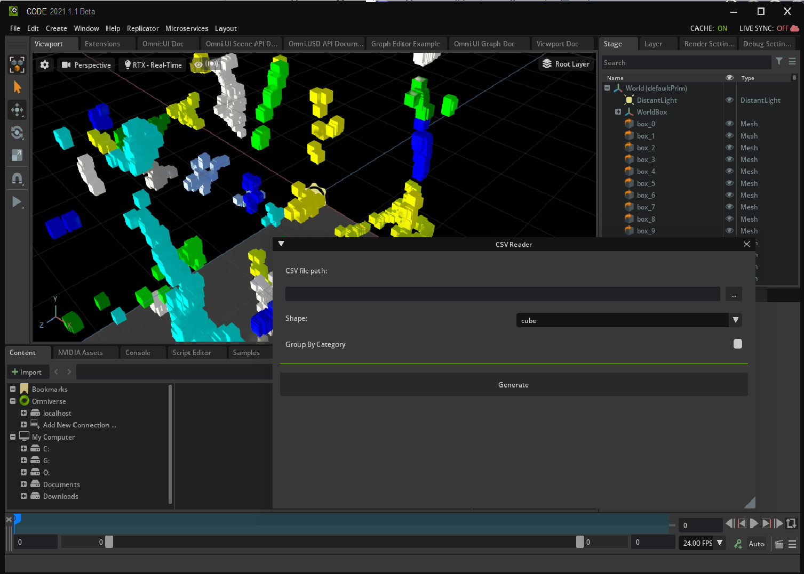

## CVS Reader Extension Sample

README - June 29nd 2022

To read first:
--------------
This sample is one example on: 
-- handling references in one USD stage 
-- using csv python module 
-- populating a 3d scene with objects at X,Y,Z from CSV File 

Content of the package:
-----------------------
one folder called 'kit-extension-sample-csv-reader' that contains the different elements making it one extension.
you'll findr:
- \config : the .toml file describing the extension (what will be seen in the extension manager when running OV) + some settings (in particular to dowload 'pandas' package (necessary to read CSV files.
- \data : some icons/pictures 
- \docs : some docs file (that are used when opening the extension in OV (such as the changelog)).
- \*.py : where the python extension programs are (_init_.py, extension.py, models.py, views.py)
	

How to use it in OV:
--------------------
1) start your app
2) in the Window/Extensions (top menu bar) : search for CSV -> get the extension and enable it
3) a new UI window should appear (called CSV Reader)
4) click on 'Generate' -> that should create elements here and there based on the info from the CSV file
5) Note that it takes by default the CSV sample from the data folder, but you can as well select another file with the filepicker '...' button

Known limitations :
------------------
All limitations are due to the fact this is to be used as one training sample

## Contributing
The source code for this repository is provided as-is and we are not accepting outside contributions.

