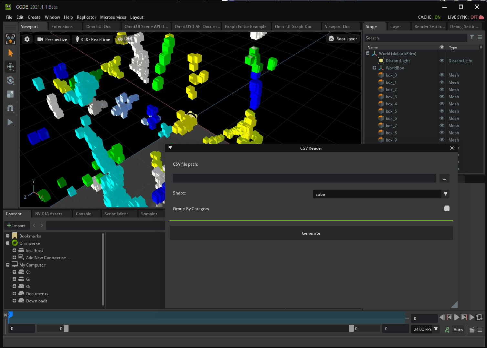
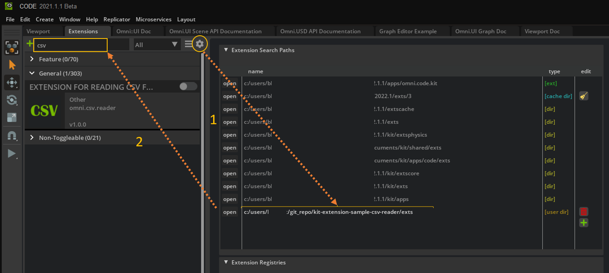
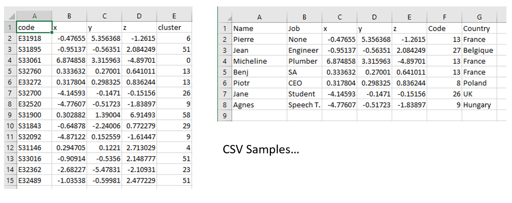
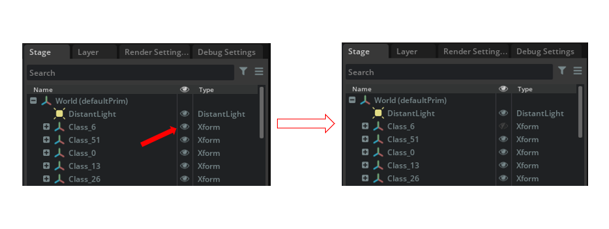

# Create One CVS Reader with Omniverse Kit Extensions

**CSV** File, or **C**omma **S**eparated **V**alues, is the simplest form for storing data/information separated by commas. You can learn more about them in this [Wikipedia article](https://en.wikipedia.org/wiki/Comma-separated_values).
CSV files are commonly used to exchange data of various type and are broadly used. For example: 

- the position of radio antennas and their types spread accross one town/region
- the position of hotels in Paris and their grade,

In this case the CSV file contains X,Y,Z information about the position of
some elements to be placed in a 3D environment, as well as a cluster column (representing some extra info), that will be used color the elements by group.

## Learning Objectives

In this guide, you learn how to:

- Open a CSV file and read it
- Place one shape at an X,Y,Z position given by the CSV File
- Create USD references for the shapes to save resources
- Color the shapes based on data retrieved from the CSV file

<p align="center">
    
<p>

## Prerequisites

- Omniverse Code 2022.1 or above
- [Omniverse compatible GPU](https://docs.omniverse.nvidia.com/app_view/common/technical-requirements.html)
- Working knowledge of Python
- Working knowledge of USD in particular the notion of reference API
  - [PIXAR USD Tutorial referencing](https://graphics.pixar.com/usd/release/tut_referencing_layers.html)
  - [NVIDIA Developer page](https://developer.nvidia.com/usd/tutorials)
  - [NVIDIA DLI Course](https://courses.nvidia.com/courses/course-v1:DLI+S-FX-02+V1/)
- [CSV](https://en.wikipedia.org/wiki/Comma-separated_values)

## Table of Contents

1. [Download the Starter Project](#1-download-the-starter-project)

    1.1 [Load the Extension](#11-load-the-extension)

    1.2 [Load the Extension](#11-load-the-extension)

2. [](#2-prepare-the-stage)

    2.1 [Clear the Stage](#21-clear-the-stage)

    2.2 [Create a New Stage](#22-create-a-new-stage)

    2.3 [Set Stage Parameters](#23-set-stage-parameters)

    2.4 [Add a Light](#24-add-a-light)

3. [CSV File](#3-csv-file)

    3.1 [CSV File Format](#31-csv-file-format)

    3.2 [Check that the File Exists](#32-check-that-the-file-exists)

    3.3 [Read the CSV File](#33-read-the-csv-file)

    3.4 [Process the CSV File](#34-process-the-csv-file)

4. [Create Each Shape](#4-create-each-shape)

    4.1 [Determine the Prim Path](#41-determine-the-prim-path)

    4.2 [Insert a Reference Prim](#42-insert-a-reference-prim)

    4.3 [Set the Position of the Prim](#43-set-the-position-of-the-prim)

    4.4 [Color the Shapes](#44-color-the-shapes)

5. [Conclusions](#5-conclusions)

## 1. Download the Starter Project

To get the assets for this hands-on lab, please clone the `tutorial-start` branch of `kit-extension-sample-csv-reader` [KitExtCSVReader](https://github.com/NVIDIA-Omniverse/kit-extension-sample-csv-reader).

`git clone -b tutorial-start [https://github.com/NVIDIA-Omniverse/kit-extension-sample-csv-reader.git](https://github.com/NVIDIA-Omniverse/kit-extension-sample-csv-reader.git)'

## 1.1 Load the Extension

In the extension tab, click on the **gear wheel**. Next, in the **extension search path**, add the path to the `exts` sub-folder where you cloned the git repository. Then, search for **CSV** in the extension tab, and enable the extension by clicking on its toggle button.

<p align="center">
    
<p>

To learn more about the other files in the repository, please check the [Build an Omniverse Extension in less than 10 Minutes](https://www.nvidia.com/en-us/on-demand/session/omniverse2020-om1483/), which explains how to create on extension.

## 1.2 Open `models.py`

This tutorial will focus on the `models.py` file found in the `exts/omni.csv.reader/omni/csv/reader/`  directory, and in particular, on `Generate()`. The starting point of `Generate()` is included below for your reference:

```python
        def Generate(self):
                 
                # Clear the stage

                # create a new stage with Y up and in meters

                #  set the up axis

                #  set the unit of the world

                # define the root prim

                # Define the root prim as the default

                # add a light
        
                # check that CSV exists

                    # Read CSV file

                        #Iterate over each row in the CSV file
                        #   Skip the header row
                        #   Don't read more than the max number of elements
                        #   Create the shape with the appropriate color at each coordinate
                            
                            #Read data from the next row
    
                            # root prim

                            # create the prim cluster path

                            # add group to path if the user has selected that option

                            #create the prim if it does not exist

                            #Create first reference prim

                            #Create instance to reference prim

                            #Get mesh from shape instance

                            #Set location
                            
                            #Set Color
    
```

> 📝 **Note:**  CSV Sample Files are provided within the _data_ folder of this extension

## 2. Prepare the Stage

This section demonstrates how to prepare a stage for shapes to be imported from a CSV file.

### 2.1 Clear the Stage

The first step is to clear the stage in order to remove any data from previous imports. This is done with the following code:

```python
        # Clear the stage
        stage = omni.usd.get_context().get_stage()
        primRoot = stage.GetPrimAtPath(self.rootUrl)
        if (primRoot.IsValid()):
            stage.RemovePrim(self.rootUrl)
```

The first statement gets a reference to the current stage. The second statement gets a reference to the root prim, and if that prim is valid it is cleared.

### 2.2 Create a New Stage

Next a new stage is created with the following statements:

```python
        # create a new stage with Y up and in meters
        if omni.usd.get_context().new_stage() is False:
            carb.log_warn(f"failing creating a new stage")
            return None
                
        stage = omni.usd.get_context().get_stage()
```

Here a new stage is created. If that fails a warning is issued and `Generate()` returns. Otherwise, the new stage is retrieved to be used moving forward.

### 2.3 Set Stage Parameters

Then, the parameters for the stage are set with the statements below:

```python
        #  set the up axis
        UsdGeom.SetStageUpAxis(stage, UsdGeom.Tokens.y)
        #  set the unit of the world
        UsdGeom.SetStageMetersPerUnit(stage, self.stage_unit_per_meter)
        # define the root prim
        stage.DefinePrim(self.rootUrl)
        # Define the root prim as the default
        rootPrim = stage.GetPrimAtPath(self.rootUrl)
        stage.SetDefaultPrim(rootPrim)
```

In these statements, the `y` axis is set to up, the stage units are set to meters, the root prim is set and the root prim is set to default. These steps are all necessary so that when we import shapes from a CSV file they have the up-direction we expect, are the correct size, and are added to the correct location within the stage tree.

### 2.4 Add a light

Finally, a light is added so that the shapes are visible once imported: 

```python
        # add a light
        stage = omni.usd.get_context().get_stage()
        LightUrl = self.rootUrl + '/DistantLight'
        newLight = UsdLux.DistantLight.Define(stage, LightUrl)
        newLight.CreateAngleAttr(0.53)
        newLight.CreateColorAttr(Gf.Vec3f(1.0, 1.0, 0.745))
        newLight.CreateIntensityAttr(5000.0)
```

## 3. CSV file

This section demonstrates how to open and read from a CSV file.

### 3.1 CSV File Format

CSV Files are common file format used by Data-scientists to store data. Two sample CSV files are shown below:

<p align="center">
    
<p>

the common format for CSV files contains a header in the first line with names for the different fields and any number of following lines which contain values for each column. Each row represents one element in the list.

The rest of this section will outline how to open and read the data from a CSV file.

### 3.2 Check that the File Exists

It is a good practice to check that a file exists before trying to open it as shown below:

```python
    # check that CSV exists
    if os.path.exists(self.CSVFilePath):
```

If the file exists, then continue. If not, gracefully exit the routine and preferably notify the user that the file does not exist.

### 3.3 Read the CSV file

To open and read one CSV file, use Python’s inbuilt [**_csv_**](https://docs.python.org/3/library/csv.html) module ad demonstrated in the following snippet:

```python
    # Read CSV file
    with open(self.CSVFilePath, newline='') as csvfile:
        csvReader = csv.reader(csvfile, delimiter=',')
        i = 1
```

Here the file is opened with the `open` statement and then then `csv.reader` reads the files contents into a list. The iterator, `i`, will be used later to name each shape.

### 3.4 Process the CSV file

Each line of the CSV is processed using the following code block:

```python
    #Iterate over each row in the CSV file
    #   Skip the header row
    #   Don't read more than the max number of elements
    #   Create the shape with the appropriate color at each coordinate
    for row in itertools.islice(csvReader, 1, self.maxElements):
        name = row[0]
        x = float(row[1])
        y = float(row[2])
        z = float(row[3])
        cluster = row[4]
```

In the first statement, the `itertools` module is used to process only the correct rows. `islice()` will take rows from `csvReader` starting at the index of 1 (this skips the header) and until the end of the list or `self.maxElements`, whichever comes first.

The next few statements retrieve the name, coordinates, and cluster number from the given row.

If you would like to print out information as it runs in order to debug the code, you could add the following code:

```python
    carb.log_warn(f"X: {x} Y: {y} Z: {z}")
```

This would print the coordinates from each row to the console. Remove those lines after validating that reading was successfull - no need to keep that kind of debugging in the final code.

## 4. Create each shape

This section will go through the creation of each shape at the correct location in the correct color.

### 4.1 Determine the Prim Path

The prim path is determined using the following code: 

```python
    # root prim
    primClusterUrl = self.rootUrl

    # add group to path if the user has selected that option
    if self.groupByCluster:                    
        primClusterUrl += self.clusterLayerRoot + cluster
    
    primCluster = stage.GetPrimAtPath(primClusterUrl)

    #create the prim if it does not exist
    if not primCluster.IsValid():
        UsdGeom.Xform.Define(stage, primClusterUrl)
        
    shapeUrl = primClusterUrl + '/box_%d' % i
    i += 1
```

First, all prims share the same root url so the path is made with the url. Second, if the user has selected to have the prims grouped, a group is added to the end of the url. Next, if that cluster does not exist yet it is created. Finally, the name of the individual prim is appended to the end of the path and the iterator is incremented.

In the code above, prims are grouped if the user has selected the grouping option. Imagine that the `cluster` refers to the type of object (ie. `cluster 6` refers to `street lights` and `cluster 29` to mail boxes). In that situation grouping can be very useful because Instead of selecting each `street light` one by one in the stage scene, their group can be selected instead. This would let a user easily hide/show the entire group or edit the group in some other way.

<p align="center">
    
<p>

### 4.2 Insert a Reference Prim

When working with USD scene composition, using a _reference_ is helps with performance. References can be read about in the [USD Glossary](https://graphics.pixar.com/usd/docs/USD-Glossary.html#USDGlossary-References).

Here, instead of creating one prim per line in the CSV, a single prim is created and then a reference to that shape is made for each line in the CSV. This has several benefits:

1. If the referred shape is changed, all elements would also change.
2. The references are quicker to create than new shapes
3. If saved, the output file will be smaller

This is done with the following code:

```python
    #Create reference prim
    refShape = stage.OverridePrim(shapeUrl)

    #Create instance to reference prim
    refShape.GetReferences().AddReference(str(self.ShapeFilePath), '/MyRef/RefMesh')
```

Here the reference is created and then used.

### 4.3 Set the Position of the Prim

Next, the position of the prim is set as follows:

```python
    #Get mesh from shape instance
    nextShape = UsdGeom.Mesh.Get(stage, shapeUrl)

    #Set location
    nextShape.AddTranslateOp().Set(
        Gf.Vec3f(
            self.scaleDataConverter*x, 
            self.scaleDataConverter*y,
            self.scaleDataConverter*z))
```

In the first statement, a reference to the reference's mesh is assigned to the `nextShape` property and in the next statement it is transformed according to the data read from the CSV file. Note that each is scaled by a constant value. This is simply because the shapes are large relative to the values of in the CSV file and so the translations are scaled up until the shapes are separated by a resonable amount of space.

### 4.4 Color the Shapes

Finally, the shapes are collored with this code: 

```python
    #Set Color
    nextShape.GetDisplayColorAttr().Set(
        categoryColors[int(cluster) % self.maxNumberOfCluster])
```

Here, the color display attribute is set on each prim according to its cluster attribute read from the CSV file.

## 5. Conclusions

The final result should match the block below:

```python
    def Generate(self):
        
        # Clear the stage
        stage = omni.usd.get_context().get_stage()
        primRoot = stage.GetPrimAtPath(self.rootUrl)
        if (primRoot.IsValid()):
            stage.RemovePrim(self.rootUrl)

        # create a new stage with Y up and in meters
        if omni.usd.get_context().new_stage() is False:
            carb.log_warn(f"failing creating a new stage")
            return None
                
        stage = omni.usd.get_context().get_stage()
        #  set the up axis
        UsdGeom.SetStageUpAxis(stage, UsdGeom.Tokens.y)
        #  set the unit of the world
        UsdGeom.SetStageMetersPerUnit(stage, self.stage_unit_per_meter)
        # define the root prim
        stage.DefinePrim(self.rootUrl)
        # Define the root prim as the default
        rootPrim = stage.GetPrimAtPath(self.rootUrl)
        stage.SetDefaultPrim(rootPrim)

        # add a light
        stage = omni.usd.get_context().get_stage()
        LightUrl = self.rootUrl + '/DistantLight'
        newLight = UsdLux.DistantLight.Define(stage, LightUrl)
        newLight.CreateAngleAttr(0.53)
        newLight.CreateColorAttr(Gf.Vec3f(1.0, 1.0, 0.745))
        newLight.CreateIntensityAttr(5000.0)

        # check that CSV exists
        if os.path.exists(self.CSVFilePath):
            # Read CSV file
            with open(self.CSVFilePath, newline='') as csvfile:
                csvReader = csv.reader(csvfile, delimiter=',')
                i = 1
                #Iterate over each row in the CSV file
                #   Skip the header row
                #   Don't read more than the max number of elements
                #   Create the shape with the appropriate color at each coordinate
                for row in itertools.islice(csvReader, 1, self.maxElements):
                    name = row[0]
                    x = float(row[1])
                    y = float(row[2])
                    z = float(row[3])
                    cluster = row[4]
                    
                    # root prim
                    primClusterUrl = self.rootUrl

                    # add group to path if the user has selected that option
                    if self.groupByCluster:                    
                        primClusterUrl += self.clusterLayerRoot + cluster
                    
                    primCluster = stage.GetPrimAtPath(primClusterUrl)

                    #create the prim if it does not exist
                    if not primCluster.IsValid():
                        UsdGeom.Xform.Define(stage, primClusterUrl)
                        
                    shapeUrl = primClusterUrl + '/box_%d' % i
                    i += 1

                    #Create reference prim
                    refShape = stage.OverridePrim(shapeUrl)

                    #Create instance to reference prim
                    refShape.GetReferences().AddReference(str(self.ShapeFilePath), '/MyRef/RefMesh')
                                    
                    #Get mesh from shape instance
                    nextShape = UsdGeom.Mesh.Get(stage, shapeUrl)

                    #Set location
                    nextShape.AddTranslateOp().Set(
                        Gf.Vec3f(
                            self.scaleDataConverter*x, 
                            self.scaleDataConverter*y,
                            self.scaleDataConverter*z))

                    #Set Color
                    nextShape.GetDisplayColorAttr().Set(
                        categoryColors[int(cluster) % self.maxNumberOfCluster])   
```

This tutorial has demonstrated how to read a CSV file and use its data to place shapes in a scene. Rather than place many unique shapes, the tutorial used references to place copies of the same shape in an efficient way. The shapes were located and colored based on data in the CSV file.
